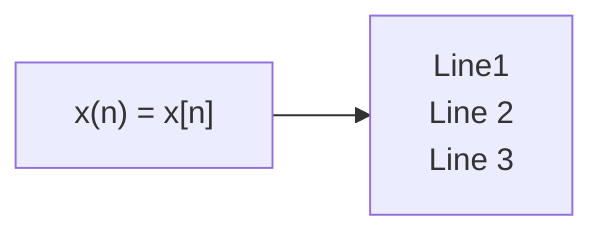

# dasp_tutorial


```
cargo add dasp_signal dasp_sample
```
> Returns :
```yaml
    Updating crates.io index
      Adding dasp_signal v0.11.0 to dependencies.
             Features:
             + std
             - all
             - all-no-std
             - boxed
             - bus
             - dasp_envelope
             - dasp_rms
             - dasp_window
             - envelope
             - rms
             - window
             - window-hanning
             - window-rectangle
      Adding dasp_sample v0.11.0 to dependencies.
             Features:
             + std
```

**The Cauchy-Schwarz Inequality**

```math
\left( \sum_{k=1}^n a_k b_k \right)^2 \leq \left( \sum_{k=1}^n a_k^2 \right) \left( \sum_{k=1}^n b_k^2 \right)
```

**DSP sequence**

```math
x = \{ x[n] \}, -\infty < n < \infty
```

```math
x[n] = x_a ( nT ), -\infty < n < \infty
```


```math
=> x[n] = x(t)|_t=nT_s
```

- [ ] [Discrete-time signal processing basics](https://signalprocessingsystems.netlify.app/disciplines/discrete/discretesignalprocessing_main/)

---
**NOTE**

```math
x(t) = cos(2 \pi . 400t) @ f_s = 1/T_s 
```

---

%%{init: {"flowchart": {"htmlLabels": false}} }%%




# References

- [ ] [Writing mathematical expressions](https://docs.github.com/en/get-started/writing-on-github/working-with-advanced-formatting/writing-mathematical-expressions)
- [ ] [LaTeX/Mathematics](https://en.wikibooks.org/wiki/LaTeX/Mathematics)
- [ ] [Prof. Alan V. Oppenheim | 6.341 | Fall 2005 | Graduate Discrete-Time Signal Processing](https://ocw.mit.edu/courses/6-341-discrete-time-signal-processing-fall-2005/)

```
